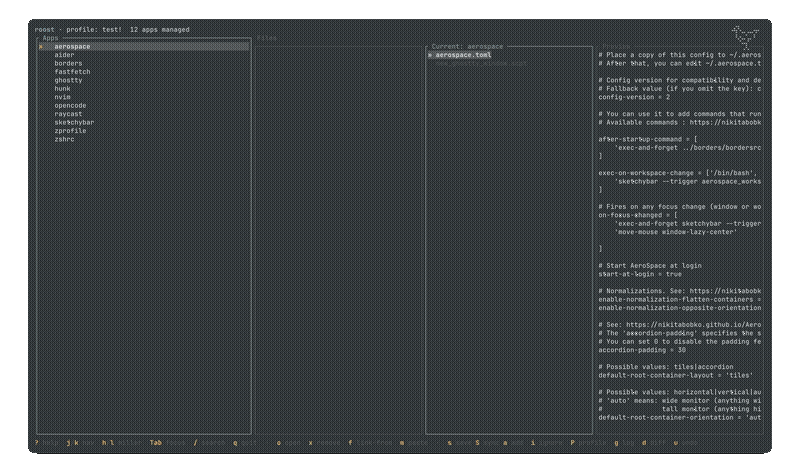

[](https://www.rust-lang.org/) [](LICENSE) [](https://crates.io/crates/roost-dot)

```text
                  ,.
                 (\(\)
 ,_              ;  o >
  {`-.          /  (_)
  `={\`-._____/`   |
   `-{ /    -=`\   |
    `={  -= = _/   /
       `\  .-'   /`               _ __ ___   ___  ___| |_
        {`-,__.'=                | '__/ _ \ / _ \/ __| __|
         ||                      | | | (_) | (_) \__ \ |_
         | \                     |_|  \___/ \___/|___/\__|
 --------/\/\---------------------------------------------
```

# `roost` — per-device dotfile profiles, symlink-backed, git-synced

Roost is a terminal-based dotfile manager that moves your application configuration files into a central directory (`~/.roost/`), organized by device-specific **profiles**, and creates symlinks back to their original locations. Optionally sync everything via Git for multi-device setups.



## Features

- **Per-device profiles** — different machines get different config sets
- **Symlink-based** — apps write to their standard locations, edits are reflected instantly
- **Interactive TUI and CLI** — browse and manage configs in a terminal interface, or script with subcommands
- **Git sync** — push/pull your entire dotfile store to a remote repository with conflict detection
- **Safe rollback** — selective git checkout preserves apps not present at the target commit
- **Cross-profile sharing** — link apps from one profile into another (zero-copy) or copy them independently (planned, not yet available)
- **Built-in diagnostics** — `roost doctor` checks for broken symlinks, config inconsistencies, orphaned files
- **Git history** — `diff`, `log`, `undo`, and `rollback` commands for config change management
- **Fuzzy search** — quickly find apps and files in the TUI
- **Cross-platform** — works on macOS, Linux, and Windows (with symlink support)
- **Confidence-scored app detection** — automatically identifies 120+ known applications during setup
- **Safety features** — atomic config writes, path traversal validation, app name sanitization, and config validation on load

## Prerequisites

- Rust 1.85 or later (edition 2024)
- `git` CLI

## Installation

From crates.io:

```sh
cargo install roost-dot
```

From source:

```sh
git clone https://github.com/mt-22/roost.git
cd roost
cargo install --path .
```

## Quick Start

1. `roost init` — Interactive setup wizard: choose a profile name, set up git remote (optional), select apps to manage
2. After init, your configs are symlinked into `~/.roost/<profile>/`
3. `roost` — Launch the TUI to browse apps, edit configs, manage profiles
4. `roost sync` — Push changes to your remote repository
5. On another device, `roost init` with the same remote, and your configs are available

## CLI Commands

| Command | Description |
|---------|-------------|
| `roost init` | Initialize roost (interactive setup wizard) |
| `roost` | Launch the TUI (default when no command given) |
| `roost add <path>` | Ingest a config path into the active profile |
| `roost remove <app>` | Stop managing an app, restore original files |
| `roost restore <app>` | Restore a single app's symlink |
| `roost status` | Show managed apps and link status |
| `roost where <app>` | Print where an app's files live in `~/.roost/` |
| `roost sync` | Stage, commit, pull (rebase), and push |
| `roost save [message]` | Stage and commit changes |
| `roost diff` | Show uncommitted changes |
| `roost log` | Show recent commits |
| `roost undo [n]` | Undo the last n commit(s) (destructive) |
| `roost rollback <hash>` | Reset to a specific commit (destructive) |
| `roost doctor` | Run diagnostics on config and symlinks |
| `roost remote` | Show the current git remote URL |
| `roost remote <url>` | Set the git remote URL |
| `roost profile add <name>` | Create a new profile (clones active profile's apps) |
| `roost profile add <name> --from <profile>` | Create a new profile copying apps from an existing profile |
| `roost profile list` | List all profiles (active marked with `*`) |
| `roost profile switch <name>` | Switch active profile (relinks symlinks) |
| `roost profile delete <name>` | Delete a profile from config |
| `roost profile rename <old> <new>` | Rename a profile in config |
| `roost ignore <pattern>` | Add a global ignore pattern |
| `roost ignore --app <app> <pattern>` | Add an ignore pattern for a specific app |
| `roost ignore --list` | List all ignore patterns |
| `roost adopt` | Adopt orphaned files into roost |
| `roost completions <shell>` | Generate shell completion script (bash, zsh, fish, powershell, elvish) |

## TUI Keybindings

### Navigation

| Key | Action |
|-----|--------|
| `j` / `Down` | Move down |
| `k` / `Up` | Move up |
| `h` / `Left` | Go to parent (Miller columns) / switch focus to Apps |
| `l` / `Right` | Enter directory / open file / switch focus to Files |
| `Tab` | Toggle focus between Apps and Files panels |
| `/` | Fuzzy search apps or files |
| `q` / `Esc` | Quit / close dialog |

### Actions

| Key | Action |
|-----|--------|
| `e` / `Enter` | Open file in `$EDITOR` |
| `o` | Open primary config of selected app |
| `p` | Set primary config for current file |
| `a` | Add a new app |
| `x` | Remove selected app |
| `s` | Save changes (git commit) |
| `S` | Sync with remote |
| `d` | Show working tree diff |
| `g` | View git log |
| `u` | Undo last commit |
| `r` | Rollback to selected commit (git log dialog only) |
| `f` | Import app from another profile (planned) |
| `m` | Paste app into another profile (planned) |
| `i` | Manage ignore patterns |
| `P` | Profile dialog (switch / create / delete) |
| `?` | Help (searchable keybind reference) |

## How It Works

`~/.roost/` is the home of all managed configs.

- `roost.toml` — shared, git-tracked config (profiles, apps, ignore patterns, remote URL)
- `local.toml` — device-local, git-ignored (active profile, OS info, per-device link paths)
- Profile directories (`~/.roost/<profile>/`) hold the actual config files

During setup, the original config file is moved into `~/.roost/<profile>/` and a symlink is created at the original location pointing to the roost copy. Apps continue reading and writing to their standard paths — all changes are stored inside the roost directory.

```
~/.roost/
├── roost.toml          # Shared config (git-tracked)
├── local.toml          # Device-local config (git-ignored)
├── laptop/             # Profile directory
│   ├── nvim/           # App configs (directories)
│   │   └── init.lua
│   └── misc/           # Standalone files
│       └── .gitconfig
└── desktop/
    └── ...
```

## Multi-Device Setup

### (example) Shared profile

**Device A (desktop):** Run `roost init`, create profile "shared" with common apps (zsh, git, tmux, nvim), set up git remote, `roost sync`.

**Device B (laptop):** Run `roost init` with the same git remote — pulls the shared profile. Create a new "laptop" profile for device-specific configs. Add the laptop's device-specific configs.

> **Note:** Cross-profile sharing (importing and copying apps between profiles) is planned but not yet available in the current release.

**Sync:** On each device, `roost sync` pushes/pulls changes.

## License

MIT — see [LICENSE](LICENSE)
